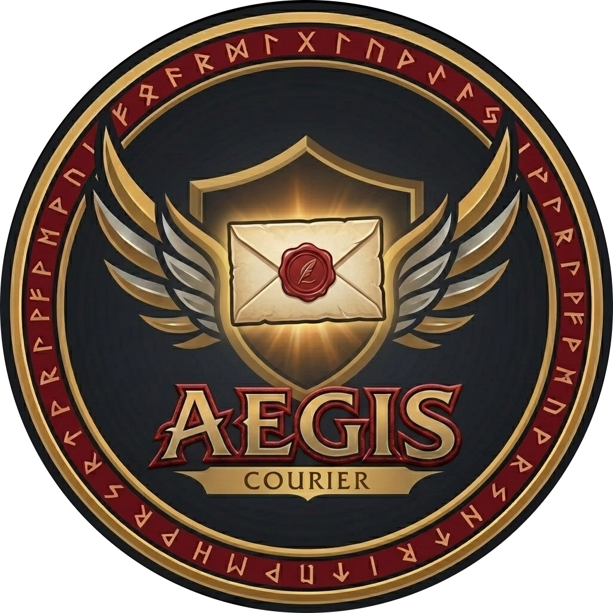
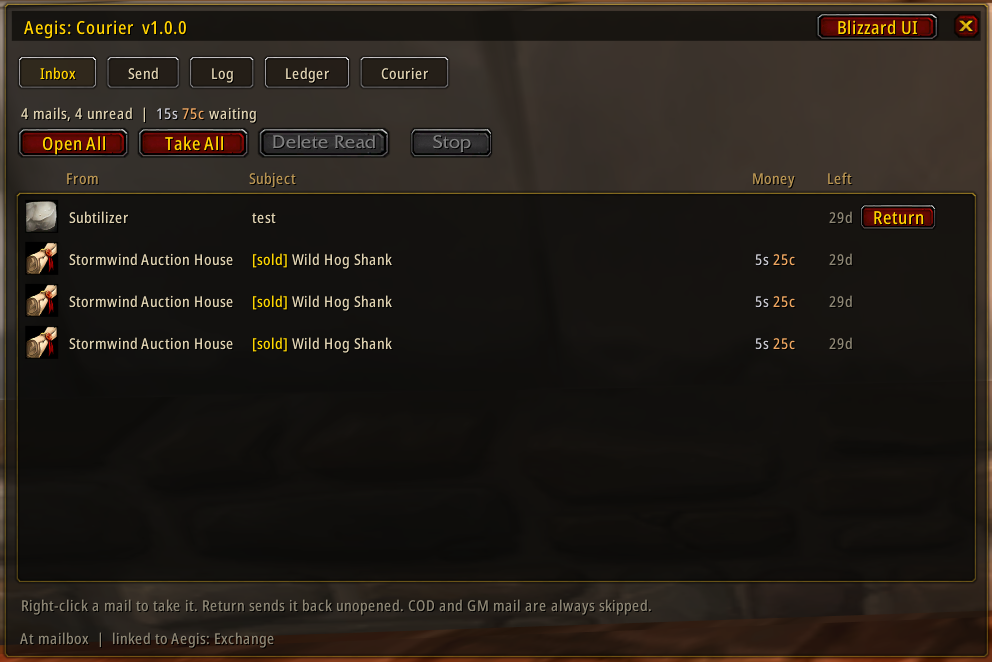
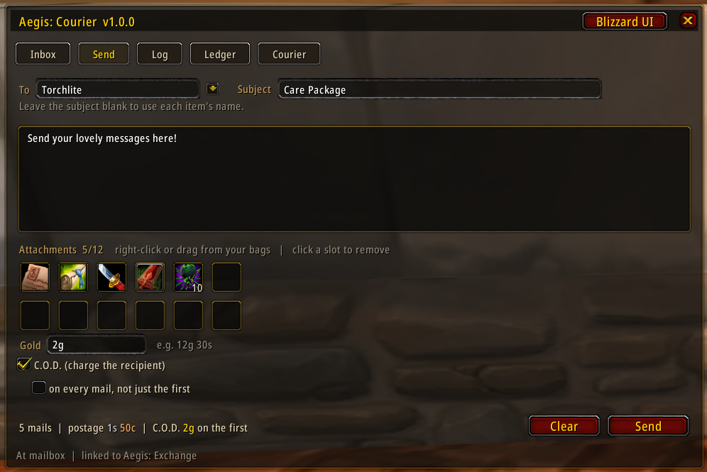
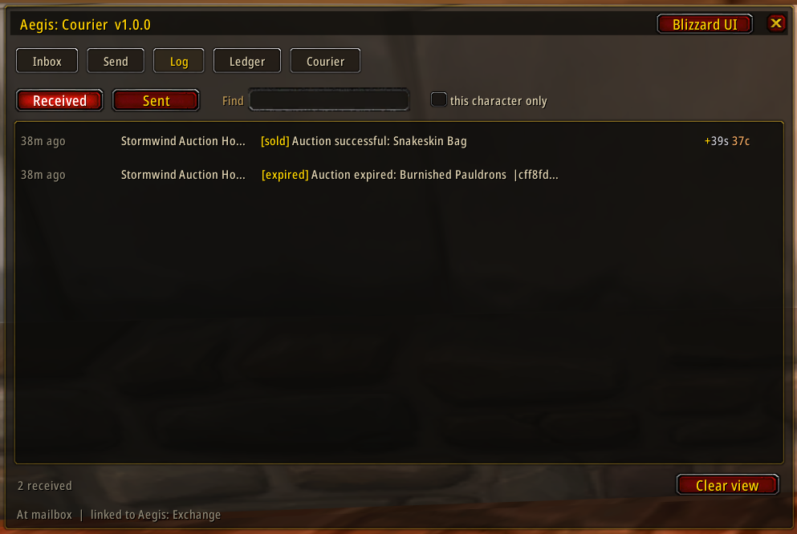
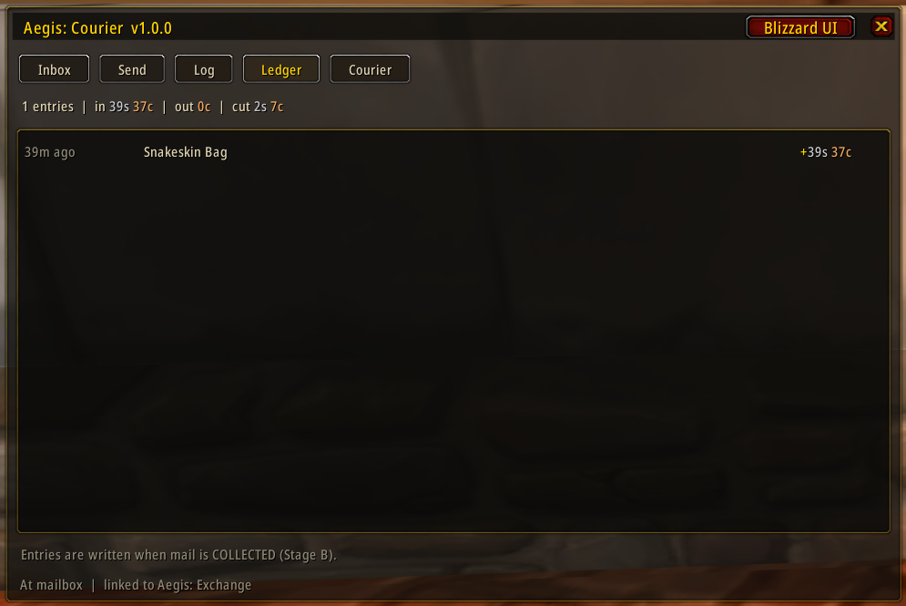
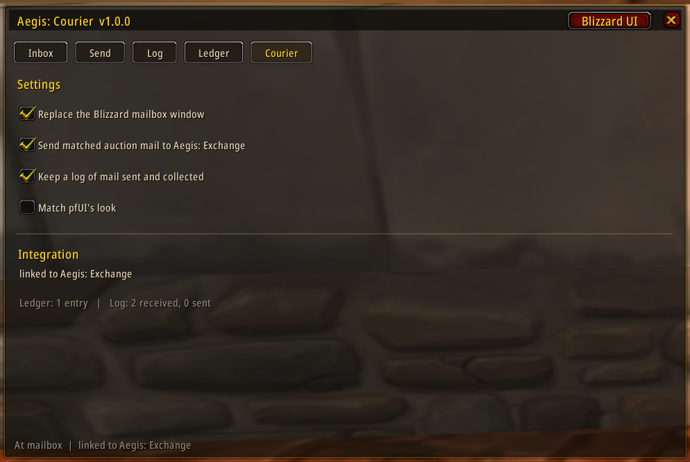
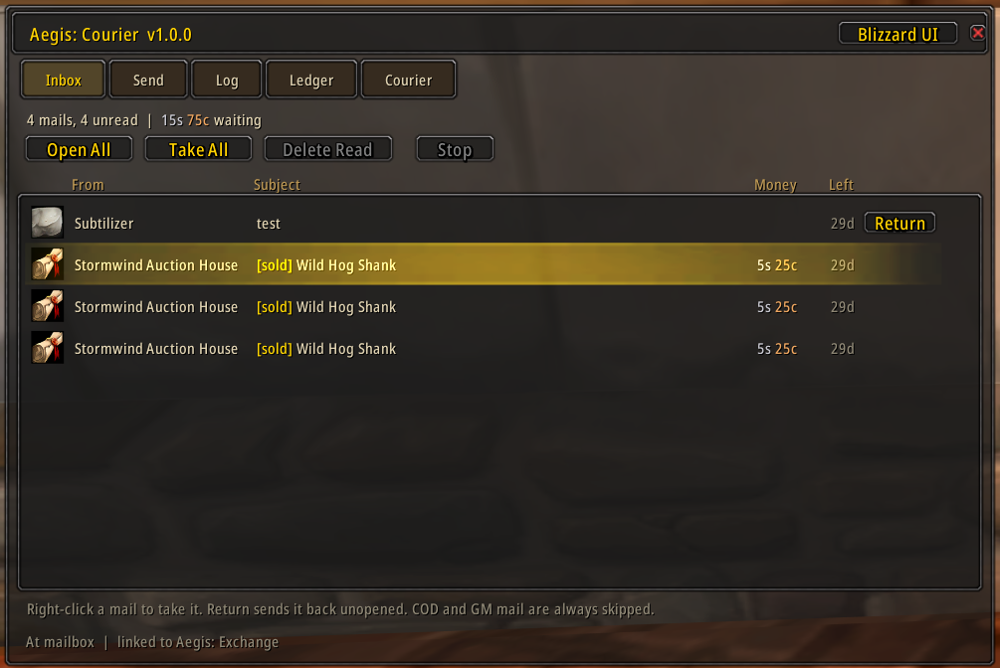

# Aegis: Courier (v1.0.1)

[](https://discord.gg/hsgPTNkSX)
[](https://octowow.st/)
[](https://capycraft.io/)
[-c79c6e?style=flat-square)](https://turtle-wow.org)

[](https://github.com/torchlite-bit/Aegis_Exchange)

A standalone mailbox companion for **Turtle WoW** (WoW 1.12 vanilla client) —
a TurtleMail replacement that also understands your auction mail, with
**optional** integration into [Aegis: Exchange](https://github.com/Torchlite-bit/Aegis_Exchange).

> **v1.0.0 — feature complete.** Reading, taking, sending, logging and
> skinning are all in and tested. Courier is a full TurtleMail replacement.

**💬 [Join the Discord](https://discord.gg/hsgPTNkSX)** for help, bug reports,
and feature ideas.

---

<p align="center">
  <br>
  <b>Aegis: Courier — Complete Mailbox Suite for Turtle WoW</b>
</p>

---

### 📷 Interface Overview

| Inbox & Auto-Loot | Send & Attachments |
| :---: | :---: |
|  |  |

| Transaction Log | Mail Ledger | Settings |
| :---: | :---: | :---: |
|  |  |  |

---

### 🎨 pfUI Theme Support
<p align="center">
  
</p>

---

## What it is

Courier **replaces** the Blizzard mailbox window rather than decorating it.
Walk up to a mailbox and Courier's window opens in its place, with the whole
inbox in one scrolling list instead of seven rows a page.

It is **fully standalone**. Aegis: Exchange is not required, not a dependency,
and not checked for at load. If you only want a better mailbox, that is all you
need to install.

## Why it exists

TurtleMail automates the mailbox well, but it never does the money maths: it
will tell you a mail came from the auction house and stop there. Courier is
built around the part that's missing — for every completed sale, the **gross
price, the 5% consignment cut, and what actually landed in your bags** — kept
in a real ledger rather than a scrollback you lose on relog.

## Install

Clone or copy this repository into `Interface/AddOns/Aegis_Courier` — the
folder name must match the `.toc`.

```
Interface/AddOns/Aegis_Courier/
    Aegis_Courier.toc
    core/
    ui/
```

**Upgrading to 1.0.0 adds a file, so restart the client** — `/reload` is not
enough for the 1.12 client to notice a new `.toc` entry.

## Mailbox actions

| Action | What it does |
|---|---|
| **Open All** | take gold and items, then delete the emptied mail |
| **Take All** | take gold and items, **keep** the mail |
| **Delete Read** | delete read mail that is already empty — never anything holding gold or an item |
| **right-click a mail** | take that one mail |
| **Return** | send a mail back to its sender, unopened |

COD and GM mail are **always** skipped, in every mode and by right-click. That
is not a setting: paying a COD by accident cannot be undone.

The **Return** button only appears on mail that can actually be returned — the
server does not allow returning auction-house or system mail, so those rows
leave the column empty rather than offering a button that would fail. It also
hides while a run is in progress, since returning a mail shifts every later
one's index.

Everything runs one mail at a time, clocked by the server's own inbox refresh,
and stops by itself if your bags fill up. A mail is never deleted while it
still holds gold or an item, even if the take failed.

Mail Courier empties is marked **read**, which is what clears the minimap's
"you have unread mail" icon; the icon is put out when you close a mailbox with
nothing unread left. Mail you only *look* at is deliberately left unread —
reading a mail that still has attachments drops its expiry to three days.

## The ledger

Every completed auction sale you collect is booked with its **gross price, the
5% consignment cut, and the net** that reached you. The entry is written when
the gold actually arrives — not when the mail shows up — so nothing is counted
that you have not received.

Only `Auction successful` mail books income. `Outbid on …` mail carries gold
too, but that is your own returned bid, so it is collected and deliberately
**not** counted as a sale.

## Sending mail

Vanilla mail carries **one attachment per message**. Courier does not pretend
otherwise — it queues up to 12 items and sends them as 12 mails, back to back,
and the cost line shows the **real** total postage rather than a single mail's.

| | |
|---|---|
| **attach** | right-click an item in your bags, or drag it onto a slot |
| **remove** | click a filled slot |
| **subject** | leave it blank and each mail is named after its item (`Silk Cloth (20)`); fill it in and a batch is numbered `subject [2/5]` |
| **recipient** | starts suggesting names you have mailed or been mailed by, most recent first |
| **gold** | type `12g 30s`, or a bare number for gold |
| **C.O.D.** | charges the recipient instead of attaching gold — optionally on every mail of a batch, not just the first |

Attached gold rides the **first** mail only, so a 10-item send does not send
your gold ten times. If an item cannot be attached — moved, sold, soulbound —
the batch stops before that mail goes out rather than posting an empty one.

Right-click in your bags only attaches while the Send tab is actually open at
a mailbox; everywhere else it keeps its normal meaning.

## The log

Separate from the ledger next door: the ledger is *money*, the log is
*correspondence* — who wrote to whom, what was attached, on which character.
Every mail Courier collects or sends is recorded, capped at 250 each way.

It is stored **account-wide**, with the character on each entry, so a
per-character view is a filter rather than a limitation. TurtleMail stores its
log per-character, which makes *"did I send that on my bank alt?"* impossible
to answer — that being the question people usually have.

One search box covers everything visible in a row, so `Bob`, `cloth` and
`sold` all narrow the list without any dropdown to hunt through.

Entries are written when a mail is actually **collected** or the server
**confirms** a send, matching the ledger — a mail that failed to send is not a
mail you sent. Turn the whole thing off in the **Courier** tab.

## Using pfUI?

If [pfUI](https://github.com/shagu/pfUI) is installed, Courier restyles itself
to match it — window, buttons, checkboxes, edit boxes and scrollbars. It is
**on by default** and lives in the **Courier** tab; with pfUI absent the option
is greyed out, because there is nothing to match.

pfUI is never a dependency. It is not in the `.toc`, every call into it is
guarded, and the worst a pfUI change can do is leave you with Courier's default
look.

Turning it **on** applies immediately. Turning it **off** needs a `/reload`,
since the styling pfUI applies cannot be cleanly undone — Courier says so
rather than appearing to do nothing.

If you manage skins through
[pfUI-addonskinner](https://github.com/mrrosh/pfUI-addonskinner), there is a
drop-in at `pfui/Aegis_Courier.lua`; see the comments at the top of that file.

## Usage

| Command | What it does |
|---|---|
| `/courier` | toggle the window (`/acr` also works) |
| `/courier status` | integration state and ledger summary |
| `/courier blizzard` | hand this mailbox visit back to the stock window |
| `/courier help` | the above |

The window also carries a **Blizzard UI** button, and the stock mail frame
gets a **Courier** button, so you can swap either way at any time without
closing the mailbox. Turning the takeover off entirely lives in the **Courier**
tab.

## Aegis: Exchange integration

If Aegis: Exchange is installed **and** exposes the integration surface,
Courier pushes each matched sale into Aegis's ledger so its History tab and
price tooltips see mail Courier collected.

The whole contract is one function call in one direction:

```lua
if AegisExchange and AegisExchange.RecordExternalTxn then ... end
```

- Courier **never** reads or writes `AegisExchangeDB`.
- Data flows **Courier → Aegis only**.
- Courier's own ledger is maintained either way, so uninstalling Aegis never
  costs you history.

**Today this seam is dormant**: `RecordExternalTxn` is Phase 0.2 on Aegis's
roadmap and has not shipped yet. Courier detects that and stays quiet — there
is nothing to configure and nothing is broken. The **Courier** tab always shows
the current state.

## Status

| Stage | Scope | State |
|---|---|---|
| **A** | Own window, mailbox takeover, inbox list, ledger/settings tabs, Aegis seam | **done** |
| **B** | Open-all / take-all / delete-read, right-click take; auction matching; sale/cut/net ledger writes on collection | **done** |
| **C.1** | Send tab: multi-item batch send, recipient autocomplete, C.O.D. modes, true cost preview | **done** |
| **C.2** | Mail log (sent + received), account-wide, with search and a per-character filter | **done** |
| **C.3** | pfUI skin, on by default when pfUI is installed | **done** |

**The roadmap is complete.** Everything in the TurtleMail audit that Courier
set out to replace is implemented, plus the auction ledger TurtleMail never
had. Future work is whatever use turns up.

## Compatibility

- **Client:** WoW **1.12** vanilla (Turtle WoW 1.18.1). Not Classic, not retail.
- **Run it instead of TurtleMail**, not alongside — both take over the mailbox
  and will fight over it.
- Running **Aegis: Exchange** alongside is supported and is the intended setup.

## Development

The client constraints (Lua 5.0, 1.12 API only) and the two mailbox behaviours
that fail *silently* when got wrong are documented in
[`CLAUDE.md`](CLAUDE.md) — read it before changing `ui/frame.lua`.

The scope of "TurtleMail replacement" is pinned to a source audit in
[`docs/turtlemail-audit.md`](docs/turtlemail-audit.md).

There is an off-client test harness that stubs the 1.12 API, so the load path,
the subject parsing, the money maths, the takeover and the whole take engine
run without the game:

```sh
lua5.1 tests/harness.lua      # 346 checks
```

Among other things it asserts that hiding the Blizzard mail frame does **not**
end the mail session and that the takeover hide is never synchronous — the two
mistakes that leave a mailbox looking fine while it silently refuses to hand
over mail — and that the take engine never deletes a mail holding an item,
never books a sale the server refused, and never counts an outbid refund as
income. The send engine is covered end to end too: batch numbering, gold on
the first mail only, C.O.D. modes, and an unattachable item stopping the batch
before an empty mail goes out.

## Credits

- **TurtleMail** ([sica42](https://github.com/sica42/TurtleMail), shirsig,
  Otari98) — the addon Courier replaces. Its event-driven open-all design and
  its use of the client's own localized `AUCTION_*_MAIL_SUBJECT` globals are
  both better than the obvious approach, and Courier follows them.

## License

MIT — see [LICENSE](LICENSE).

---

<div align="center">

**[💬 Discord](https://discord.gg/hsgPTNkSX)** · **[📜 Changelog](CHANGELOG.md)** · **[🐛 Issues](https://github.com/Torchlite-bit/Aegis_Courier/issues)**

*Aegis: Courier is part of the Aegis addon series. Happy shipping.* ✉️

</div>
